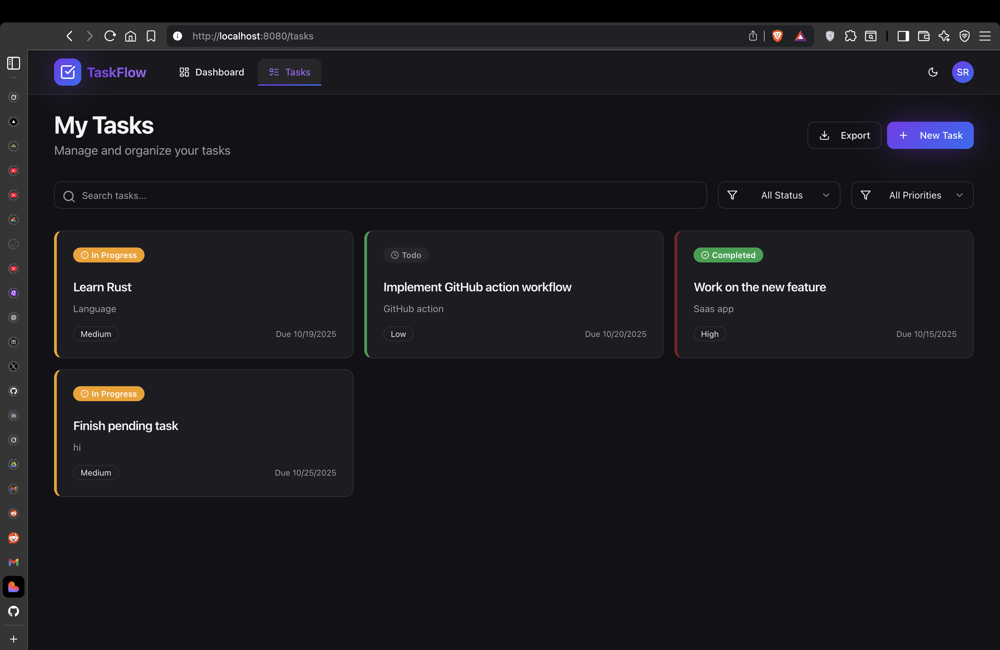
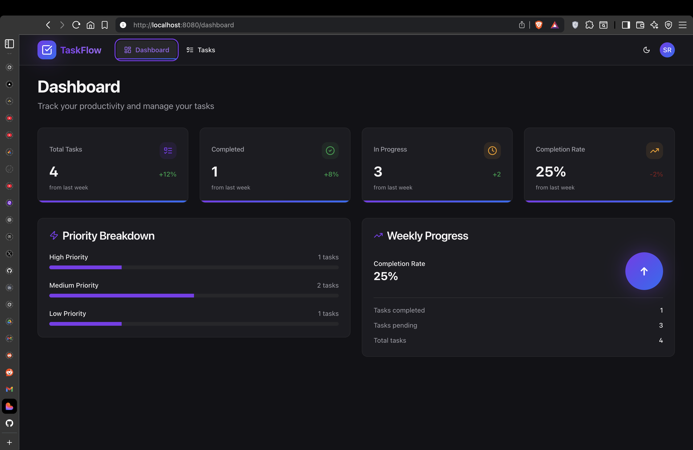
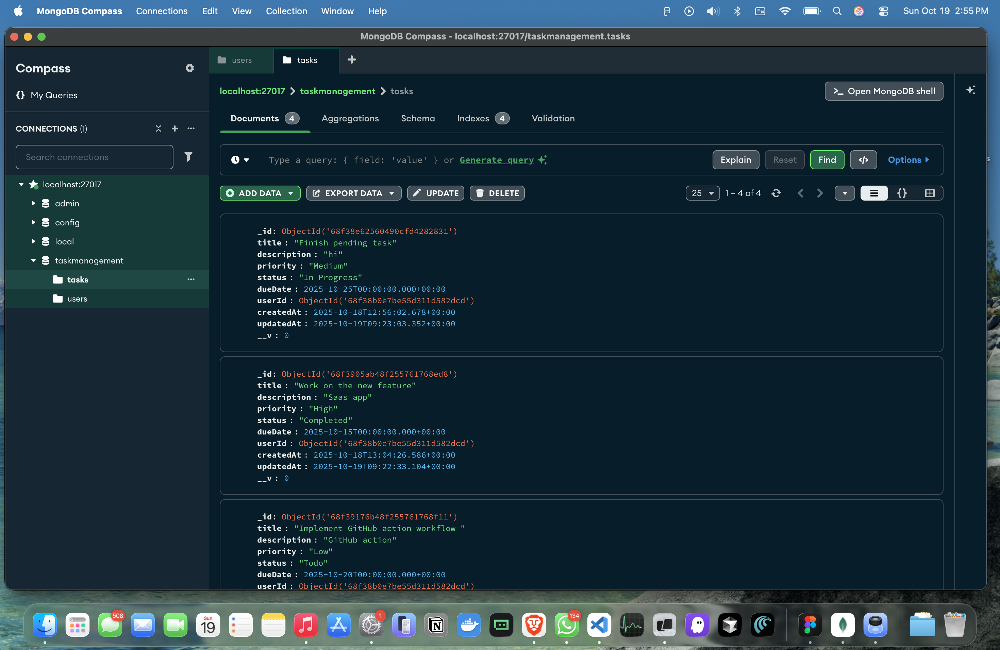

# TaskFlow - Task Management Application

A modern, responsive task management application built with React, Node.js, and MongoDB. Features include task creation, editing, filtering, and a beautiful dashboard with statistics.

## Features

- 📊 **Dashboard** with task statistics and priority breakdown
- ✅ **Task Management** - Create, read, update, and delete tasks
- 🔍 **Advanced Filtering** by status, priority, and search
- 🎨 **Modern UI** built with Tailwind CSS and shadcn/ui components
- 🔐 **User Authentication** with JWT tokens
- 📱 **Responsive Design** works on all devices
- ⚡ **Real-time Updates** with React Query

## Screenshots


### Tasks Management



### Task Dashboard


### DB View


## Tech Stack

### Frontend
- **React** with TypeScript
- **Vite** for fast development
- **Tailwind CSS** for styling
- **shadcn/ui** component library
- **React Query** for data fetching
- **Framer Motion** for animations
- **React Router** for navigation

### Backend
- **Node.js** with Express
- **MongoDB** with Mongoose
- **JWT** for authentication
- **Joi** for validation
- **CORS** for cross-origin requests

## Prerequisites

Before you begin, ensure you have the following installed:

- **Node.js** (v18 or higher)
- **npm** or **pnpm**
- **MongoDB** (running locally or MongoDB Atlas)

## Installation

### 1. Clone the Repository

```bash
git clone https://github.com/shivxmr/taskflow.git
cd taskflow
```

### 2. Backend Setup

```bash
# Navigate to backend directory
cd backend

# Install dependencies
npm install

# Create environment file
cp .env.example .env

# Edit .env file with your configuration
```

#### Environment Variables

Edit the `.env` file in the backend directory:

```env
PORT=5001
MONGO_URI=mongodb://localhost:27017/taskmanagement
JWT_SECRET=your_super_secret_jwt_key_here_make_it_long_and_random
```

### 3. Frontend Setup

```bash
# Navigate to frontend directory
cd ../frontend

# Install dependencies
npm install

# Or if you prefer pnpm
pnpm install
```

## Running the Application

### 1. Start MongoDB

Make sure MongoDB is running on your system:

```bash
# If using local MongoDB
mongod

# Or if using MongoDB Atlas, ensure your cluster is running
```

### 2. Start Backend Server

```bash
# Navigate to backend directory
cd backend

# Start the development server
npm start

# Server will run on http://localhost:5001
```

### 3. Start Frontend Development Server

```bash
# Navigate to frontend directory (in a new terminal)
cd frontend

# Start the development server
npm run dev

# Or with pnpm
pnpm dev

# Application will run on http://localhost:8080
```

## Usage

### 1. Create an Account

- Navigate to http://localhost:8080
- Click on "Register" to create a new account
- Fill in your name, email, and password

### 2. Login

- Use your credentials to log in
- You'll be redirected to the Dashboard

### 3. Manage Tasks

**Create Tasks:**
- Click "New Task" button
- Fill in task details (title, description, priority, due date)
- Click "Create Task"

**Edit Tasks:**
- Click the menu icon on any task card
- Select "Edit"
- Modify the task details
- Click "Update Task"

**Delete Tasks:**
- Click the menu icon on any task card
- Select "Delete"
- Confirm the deletion

**Filter Tasks:**
- Use the search bar to find tasks by title/description
- Filter by status (Todo, In Progress, Completed)
- Filter by priority (Low, Medium, High)

## Project Structure

```
taskflow/
├── backend/
│   ├── config/
│   │   └── db.js              # Database configuration
│   ├── controllers/
│   │   ├── authController.js  # Authentication logic
│   │   └── taskController.js  # Task management logic
│   ├── middleware/
│   │   ├── auth.js            # JWT authentication middleware
│   │   └── errorHandler.js    # Error handling middleware
│   ├── models/
│   │   ├── Task.js            # Task model
│   │   └── User.js            # User model
│   ├── routes/
│   │   ├── auth.js            # Authentication routes
│   │   └── tasks.js           # Task routes
│   ├── .env.example           # Environment variables template
│   ├── package.json
│   └── server.js              # Express server setup
├── frontend/
│   ├── public/
│   ├── src/
│   │   ├── components/
│   │   │   ├── Tasks/
│   │   │   │   └── TaskDialog.tsx
│   │   │   ├── Navbar.tsx
│   │   │   └── ui/             # shadcn/ui components
│   │   ├── contexts/
│   │   │   ├── AuthContext.tsx
│   │   │   └── ThemeContext.tsx
│   │   ├── hooks/
│   │   │   ├── use-mobile.tsx
│   │   │   └── use-toast.tsx
│   │   ├── lib/
│   │   │   └── utils.ts
│   │   ├── pages/
│   │   │   ├── Dashboard.tsx
│   │   │   ├── Login.tsx
│   │   │   ├── Register.tsx
│   │   │   ├── Tasks.tsx
│   │   │   └── NotFound.tsx
│   │   ├── services/
│   │   │   └── api.ts         # API service layer
│   │   ├── App.tsx
│   │   ├── index.css
│   │   ├── main.tsx
│   │   └── vite-env.d.ts
│   ├── components.json
│   ├── eslint.config.js
│   ├── index.html
│   ├── package.json
│   ├── postcss.config.js
│   ├── tailwind.config.ts
│   ├── tsconfig.app.json
│   ├── tsconfig.json
│   ├── tsconfig.node.json
│   └── vite.config.ts
├── screenshots/
│   ├── dashboard.png          # Dashboard view screenshot
│   ├── tasks.png              # Tasks management screenshot
│   └── task-dialog.png        # Task creation/editing dialog
├── .gitignore
└── README.md
```

## API Endpoints

### Authentication

- `POST /api/auth/register` - Register a new user
- `POST /api/auth/login` - Login user
- `POST /api/auth/logout` - Logout user

### Tasks

- `GET /api/tasks` - Get all tasks for authenticated user
- `GET /api/tasks/:id` - Get a specific task
- `POST /api/tasks` - Create a new task
- `PUT /api/tasks/:id` - Update a task
- `DELETE /api/tasks/:id` - Delete a task
- `GET /api/tasks/stats` - Get task statistics

## Environment Configuration

### Backend (.env)

```env
# Server Configuration
PORT=5001

# Database
MONGO_URI=mongodb://localhost:27017/taskmanagement

# JWT Secret (generate a long, random string)
JWT_SECRET=your_super_secret_jwt_key_here_make_it_long_and_random_123456789
```

### Frontend

The frontend is configured to work with the backend running on `http://localhost:5001`. This is automatically set up in the API service.

## Troubleshooting

### Common Issues

1. **CORS Errors**
   - Ensure the backend is running on port 5001
   - Check that the frontend is on port 8080
   - Verify CORS configuration in `backend/server.js`

2. **Database Connection Errors**
   - Make sure MongoDB is running
   - Check the MONGO_URI in your .env file
   - Verify database credentials

3. **Authentication Issues**
   - Clear browser localStorage if experiencing auth issues
   - Log out and log back in
   - Check that JWT_SECRET is set in .env

4. **Tasks Not Showing**
   - Verify you're logged in with the correct account
   - Check browser console for errors
   - Ensure backend server is running

### Development Tips

1. **Hot Reload**: Both frontend and backend support hot reload during development
2. **Console Logs**: Check browser console for detailed error information
3. **Network Tab**: Use browser dev tools to inspect API requests
4. **MongoDB Compass**: Use to inspect database directly

## Contributing

1. Fork the repository
2. Create a feature branch (`git checkout -b feature/amazing-feature`)
3. Commit your changes (`git commit -m 'Add some amazing feature'`)
4. Push to the branch (`git push origin feature/amazing-feature`)
5. Open a Pull Request

## License

This project is licensed under the MIT License - see the LICENSE file for details.

## Support

If you encounter any issues or have questions, please:

1. Check the troubleshooting section above
2. Search existing GitHub issues
3. Create a new issue with detailed information
4. Include error messages, screenshots, and steps to reproduce

---
